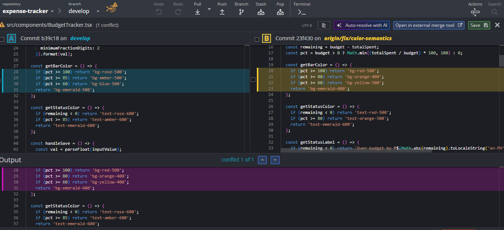
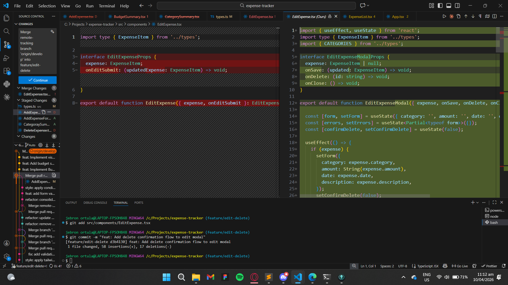

# Expense Tracker

A personal finance management application that helps users track expenses, manage budgets, and understand spending patterns.

---

## Team Members

| Full Name | Role | GitHub Username | Assigned Atomic Task |
|-----------|------|-----------------|---------------------|
| Caballes, Ervin James | UI/UX Integrator | caballeservinjames889-maker | UI/UX Integrator and Budget Tracker |
| Dejos, Pauline | Project Lead | repromantics01 | App Wiring & CategorySummary |
| Jimeno, Ken Cedrick | QA Specialist | devcedrick | Form Validation |
| Ortula, Jebron | Documentation Lead | Jebzzzzz | README.md Setup & EditExpense |
| Piangco, Pete Alexander | Lead Developer | filch119 | Form Validation & AddExpense Form |

---

## Features Implemented

- [ x ] Add Expense - Record expenses with category, amount, date
- [ x ] Expense List - Display all expenses
- [ x ] Filter by Category - View by Food, Transport, Bills, Shopping
- [ x ] Category Summary - Total spending per category
- [ x ] Budget Tracking - Set budget and show remaining amount
- [ x ] Edit Expense - Modify expense details
- [ x ] Delete Expense - Remove expenses with confirmation
- [ ] [Add any additional features implemented]

---

## Technology Stack

- **Frontend Framework:** React
- **Language:** TypeScript / JavaScript
- **Build Tool:** Vite / Create React App
- **Styling:** [Your choice]
- **State Management:** React Hooks
- **Version Control:** Git & GitHub

---

## Setup & Installation

### Prerequisites
- Node.js (v18 or higher)
- npm or yarn
- Git

### Installation Steps

1. **Clone the repository**
   ```bash
   git clone https://github.com/csci151-budgetwise-org/expense-tracker.git
   cd expense-tracker
   ```

2. **Install dependencies**
   ```bash
   npm install
   ```

3. **Run the development server**
   ```bash
   npm run dev
   ```

4. **Open your browser**
   
   [Write the URL and port where your application runs]

---

## Git Workflow & Branching Strategy

### Branches Used

- **`main`** - Production-ready code
- **`develop`** - Integration branch
- **`feature/add-expense`** - Implementation of the form and logic to record new expenses, capturing the category, amount, date, and description.
- **`feature/category-summary`** - Development of the UI to calculate and display total accumulated spending broken down per category
- **`feature/budget-tracking`** - Addition of functionality to set a monthly budget limit and dynamically show the remaining amount based on total expenses.
- **`feature/expense-filter`** - Creation of the main expense list view with capabilities to display all records and filter them by specific categories (e.g., Food, Transport, Bills).
- **`feature/edit-delete`** - Integration of the ability to modify existing expense details and a safe deletion flow that includes a user confirmation prompt.


### Documented Merge Conflicts



#### Conflict 1: Styling Updates in BudgetTracker
* **File:** `src/components/BudgetTracker.tsx`
* **What Happened:** The `develop` branch contained older color semantics for the budget progress bar (e.g., `bg-rose-500`, `bg-blue-500`). Meanwhile, the `fix/color-semantics` branch introduced an updated, warmer color palette (`bg-red-500`, `bg-orange-400`, `bg-yellow-400`) and slightly adjusted the percentage thresholds within the `getBarColor` function.
* **How it was Resolved:** We reviewed the changes and decided that the updates from the `fix/color-semantics` branch were the correct and most recent design choices. We used the VS Code merge editor to accept the incoming changes from the fix branch, ensuring the new `bg-red-500` through `bg-emerald-400` classes were retained.



#### Conflict 2: Component Overhaul in EditExpense
* **File:** `src/components/EditExpense.tsx`
* **What Happened:** The `develop` branch had a basic `EditExpense` component that only accepted an `onEditSubmit` prop. The `feature/edit-delete` branch completely overhauled this file, renaming the interface to `EditExpenseModalProps`, adding new props (`onSave`, `onDelete`, `onClose`), and introducing complex state management (`form`, `errors`, `confirmDelete`) using `useState` and `useEffect`.
* **How it was Resolved:** Since the `feature/edit-delete` branch contained the completed feature requirement, we accepted the heavily modified version from that branch. As seen in the terminal, the resolved file was staged using `git add src/components/EditExpense.tsx` and finalized with the commit message `"feat: Add delete confirmation flow to edit modal"`.

---

## Repository Links

- **Organization:** https://github.com/csci151-budgetwise-org
- **Repository:** https://github.com/csci151-budgetwise-org/expense-tracker

---

## Contributors

**Group 6 - CSci 151 Event Driven Programming**

- Caballes, Ervin James - caballeservinjames889-maker
- Dejos, Pauline - repromantics01
- Jimeno, Ken Cedrick - devcedrick
- Ortula, Jebron - Jebzzzzz
- Piangco, Pete Alexander - filch119

**Course Professors:**
- Mr. Jomari Joseph A. Barrera
- Mr. Kyle Anthony F. Nierras

**Institution:** Visayas State University - Department of Computer Science and Technology

---

**Last Updated:** [10/04/2026]
